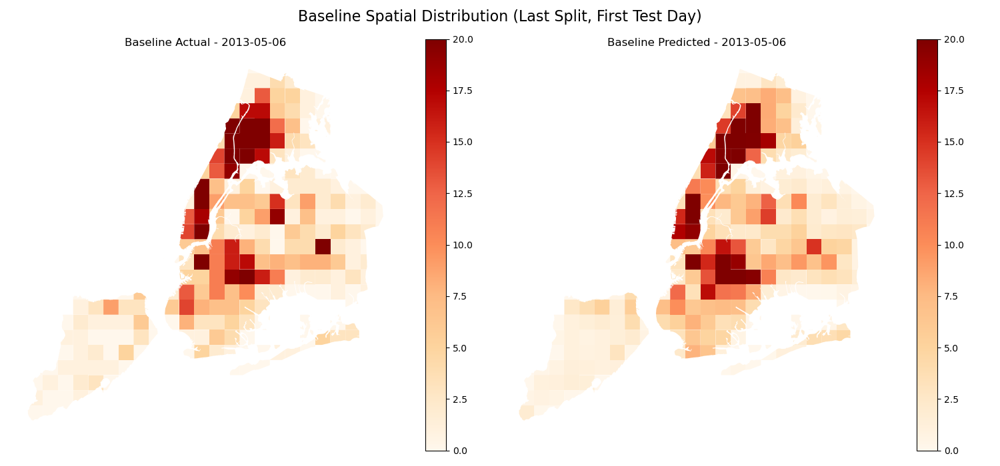
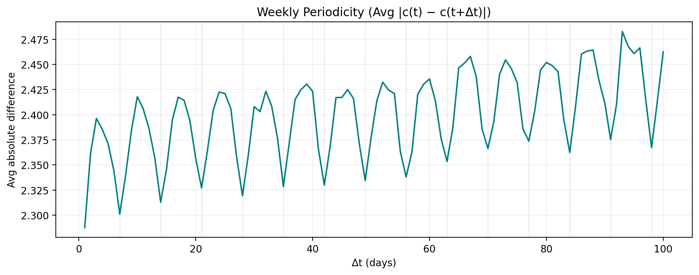

# NYC Spatiotemporal Crime Prediction

Domain-informed extensions to a Temporal-Correlated Predictor (TCP)-style model for daily crime forecasting in New York City.

This repository contains an interpretable spatiotemporal crime-prediction pipeline built on heterogeneous urban data. The project implements a TCP-style baseline with time-varying region-level linear models and evaluates three domain-informed extensions designed to capture weekly routines, day-dependent spatial structure, and holiday anomalies.

The processed dataset covers **365 days (2012-07-01 to 2013-06-30)** across **250 active NYC grid regions**, yielding **91,250 region-day observations**.

## Overview

Urban crime varies across both space and time. A model that only uses static spatial features can miss short-term changes, while a purely temporal model can overlook persistent neighborhood structure.

The baseline used here follows the main idea of the Temporal-Correlated Predictor (TCP): each region and day has a time-varying linear weight vector, while regularization encourages neighboring regions and adjacent time steps to behave coherently.

We extend this baseline with three forms of domain knowledge:

- **Weekly temporal coupling** — encourages model weights seven days apart to remain similar, reflecting recurring weekly routines.
- **Day-type spatial regularization** — uses separate spatial penalties for Monday–Thursday, Friday, and weekends.
- **Holiday offsets** — learns a shared feature-weight adjustment for holidays so that exceptional days do not have to follow ordinary weekly patterns.

The extensions are evaluated individually, in pairwise combinations, and jointly.

## Data

The target is the daily number of NYPD crime complaints in each spatial region. The model uses the following predictors:

| Feature | Description |
| --- | --- |
| `sas_count` | NYPD stop, question, and frisk events |
| `311_count` | NYC 311 service requests |
| `checkin_count` | Foursquare check-ins |
| `taxi_count` | Taxi pickups |
| `PRCP` | Daily precipitation |
| `SNOW` | Daily snowfall |
| `TMIN` | Minimum daily temperature |
| `TMAX` | Maximum daily temperature |

New York City is divided into approximately **2 km × 2 km grid cells**. Cells with no crime complaints during the study period are excluded, leaving 250 active regions. Spatial neighbors are defined by touching grid polygons.

The repository includes the processed feature matrix used by the modelling pipeline. The raw source datasets are not redistributed because of their size. The data-construction workflow is available in [`notebooks/build_feature_matrix.ipynb`](notebooks/build_feature_matrix.ipynb).

### Raw data sources

- [NYPD Complaint Data Historic](https://data.cityofnewyork.us/Public-Safety/NYPD-Complaint-Data-Historic/qgea-i56i/about_data)
- [NYPD Stop, Question and Frisk Data](https://www.nyc.gov/site/nypd/stats/reports-analysis/stopfrisk.page)
- [NYC 311 Service Requests](https://data.cityofnewyork.us/Social-Services/311-Service-Requests-from-2010-to-Present/erm2-nwe9/about_data)
- [NYC Central Park Weather](https://www.kaggle.com/datasets/danbraswell/new-york-city-weather-18692022)
- [Foursquare Check-in Dataset](https://sites.google.com/site/yangdingqi/home/foursquare-dataset)
- [NYC Taxi Trip Data](https://databank.illinois.edu/datasets/IDB-9610843)
- [NYC Borough Boundaries](https://www.nyc.gov/content/planning/pages/resources/datasets/borough-boundaries)

## Results

| Model | Test aRMSE |
| --- | ---: |
| Baseline | 2.5326 |
| Weekly | 2.5408 |
| Day-type | 2.5290 |
| Holiday | 2.5466 |
| Weekly + Day-type | 2.5257 |
| **Weekly + Holiday** | **2.5208** |
| Day-type + Holiday | 2.5305 |
| All three | 2.5274 |

The best configuration combines **weekly temporal coupling and holiday offsets**, reducing test aRMSE by approximately **0.5%** relative to the baseline.

The result suggests that routine periodicity and exceptional-day effects are complementary: weekly coupling captures recurring temporal structure, while the holiday offset provides flexibility when a calendar anomaly breaks the usual weekly pattern.

### Spatial prediction example

The baseline reproduces much of the broad hotspot/coldspot structure on the first test day, while local prediction errors remain visible.



### Weekly structure in the data

Exploratory analysis shows lower average day-to-day crime differences at lags aligned with the weekly cycle, motivating the weekly coupling term.



### Spatial autocorrelation

Global Moran's I was also computed for three day groups using an 8-nearest-neighbor spatial weights matrix over the 250 active regions.

| Day type | Moran's I | p-value |
| --- | ---: | ---: |
| Monday–Thursday | 0.5372 | 0.001 |
| Friday | 0.5225 | 0.001 |
| Saturday–Sunday | 0.5359 | 0.001 |

All three groups show strong positive spatial autocorrelation, indicating persistent spatial clustering of crime intensity.

## Repository Structure

```text
nyc-spatiotemporal-crime-prediction/
├── run_experiments.py          # Main experiment entry point
├── requirements.txt
├── LICENSE
│
├── src/
│   ├── data.py                 # Tensor preparation, holiday masks, spatial neighbors
│   ├── models.py               # TCP baseline, extended model, regularized objectives
│   ├── forecasting.py          # Alpha-stage weight forecasting
│   ├── evaluation.py           # Temporal splitting and aRMSE evaluation
│   ├── training.py             # Training, grid search, ablations, combinations
│   └── visualization.py        # Diagnostic and result visualizations
│
├── scripts/
│   └── morans_daytype.py       # Day-type Global Moran's I analysis
│
├── notebooks/
│   └── build_feature_matrix.ipynb
│
├── data/
│   ├── FEATURE_MATRIX.csv
│   └── nyc_grid_2km_active.*
│
└── results/
    ├── figures/
    └── tables/
```

## Installation

The project was developed with Python 3.10.

```bash
pip install -r requirements.txt
```

The experiment runner automatically uses CUDA when a compatible GPU is available and otherwise falls back to CPU.

## Running the Experiments

### Smoke test

To verify that the environment, data loading, model training, forecasting, evaluation, and visualization pipeline are working correctly, run:

```bash
python run_experiments.py --mode smoke
```

To force CPU execution:

```bash
python run_experiments.py --mode smoke --device cpu
```

Smoke mode uses a reduced hyperparameter grid and a small number of training epochs. It is intended only as an end-to-end pipeline check; its evaluation scores are not comparable to the reported experimental results.

Smoke-test outputs are written to:

```text
results/smoke/
├── figures/
└── tables/
```

### Full experiment

To reproduce the complete experiment configuration, run:

```bash
python run_experiments.py --mode full
```

Since `full` is the default mode, the following command is equivalent:

```bash
python run_experiments.py
```

The full pipeline performs:

1. data loading and tensor construction;
2. exploratory temporal and spatial diagnostics;
3. baseline hyperparameter search;
4. single-extension ablations;
5. pairwise extension experiments;
6. full extended-model search;
7. alpha-stage forecasting and temporal holdout evaluation;
8. result-table and figure generation.

Full experiment outputs are written to:

```text
results/
├── figures/
└── tables/
```

The complete search evaluates many model configurations and can be computationally intensive.

### Optional arguments

A specific device can be selected with:

```bash
python run_experiments.py --mode full --device cpu
```

A random seed can optionally be specified:

```bash
python run_experiments.py --mode smoke --seed 42
```

If no device is specified, the runner uses CUDA when available and otherwise falls back to CPU.

### Moran's I analysis

Run the day-type spatial autocorrelation analysis separately with:

```bash
python scripts/morans_daytype.py
```

Results are written to:

```text
results/tables/morans_daytype_results.csv
```

## Rebuilding the Feature Matrix

The modelling experiments can be run directly with the processed files in `data/`.

To rebuild the feature matrix from the public source datasets, place the required raw files under `raw_data/` following the paths used in [`notebooks/build_feature_matrix.ipynb`](notebooks/build_feature_matrix.ipynb), then execute the notebook.

The notebook handles spatial joins, daily aggregation, grid construction, feature alignment, and export of the final region-day feature matrix.

## Project Context

This project was developed as the final project for the **Urban Computing** course at Leiden University by **Yutao Liu and Roemer Ibelings**.

The project builds on the Temporal-Correlated Predictor introduced in:

> Xiangyu Zhao and Jiliang Tang. *Modeling Temporal-Spatial Correlations for Crime Prediction*. Proceedings of the 2017 ACM Conference on Information and Knowledge Management (CIKM '17), 497–506. https://doi.org/10.1145/3132847.3133024

## License

See [`LICENSE`](LICENSE) for the repository's licensing terms.
